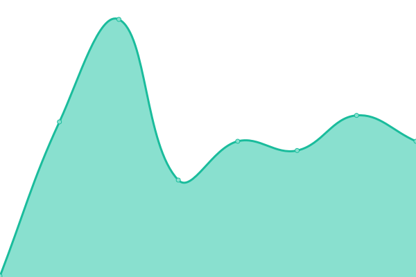

# [📈 Live Status](https://status.jocono.de): <!--live status--> **🟥 Complete outage**

This repository contains the open-source uptime monitor and status page for [Jocono](jocono.de).

We use [Issues](https://github.com/jocono-app/jocono-status/issues) as incident reports, [Actions](https://github.com/jocono-app/jocono-status/actions) as uptime monitors, and [Pages](https://status.jocono.de) for the status page.

<!--start: status pages-->
<!-- This summary is generated by Upptime (https://github.com/upptime/upptime) -->
<!-- Do not edit this manually, your changes will be overwritten -->
<!-- prettier-ignore -->
| URL | Status | History | Response Time | Uptime |
| --- | ------ | ------- | ------------- | ------ |
|  [Jocono Landing](https://www.jocono.de) | 🟥 Down | [jocono-landing.yml](https://github.com/Jocono-App/jocono-status/commits/HEAD/history/jocono-landing.yml) | 

 0ms
     
 | 

<a href="https://status.jocono.de/history/jocono-landing">0.00%</a>
    

|  [Jocono Web App](https://app.jocono.de) | 🟥 Down | [jocono-web-app.yml](https://github.com/Jocono-App/jocono-status/commits/HEAD/history/jocono-web-app.yml) | 

 0ms
     
 | 

<a href="https://status.jocono.de/history/jocono-web-app">0.00%</a>
    

|  [Jocono Web Beta App](https://app.beta.jocono.de) | 🟥 Down | [jocono-web-beta-app.yml](https://github.com/Jocono-App/jocono-status/commits/HEAD/history/jocono-web-beta-app.yml) | 

 0ms
     
 | 

<a href="https://status.jocono.de/history/jocono-web-beta-app">0.00%</a>
    

|  [Jocono Backend](https://eu-api.backendless.com/0A320D1F-05D1-4A76-FF0F-4905268F6100/8B3EF612-BBD4-4038-B20B-646431B93DB8/services/AssignRoleService/health) | 🟥 Down | [jocono-backend.yml](https://github.com/Jocono-App/jocono-status/commits/HEAD/history/jocono-backend.yml) | 

 607ms
     
 | 

<a href="https://status.jocono.de/history/jocono-backend">0.00%</a>
    

<!--end: status pages-->

[**Visit our status website →**](https://status.jocono.de)
